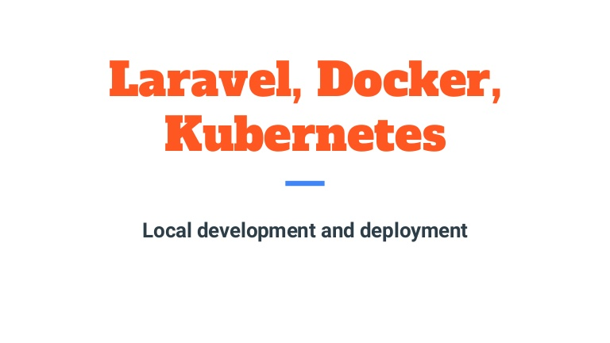

# Laravel-kubernetes

***kubernetes***

├── configmap-laravel.yaml  
├── laravel-app.yaml   
├── laravel-mysql.yaml   
├── laravel-redis.yaml   
└── secret-laravel.yaml   

***links*** 
├── app   
├── artisan   
├── bootstrap 
├── composer.json 
├── composer.lock 
├── config 
├── database 
├── Dockerfile 
├── nginx 
├── package.json 
├── phpunit.xml 
├── public 
├── README.md 
├── resources 
├── routes 
├── server.php 
├── storage 
├── tests 
├── vendor 
└── webpack.mix.js 
